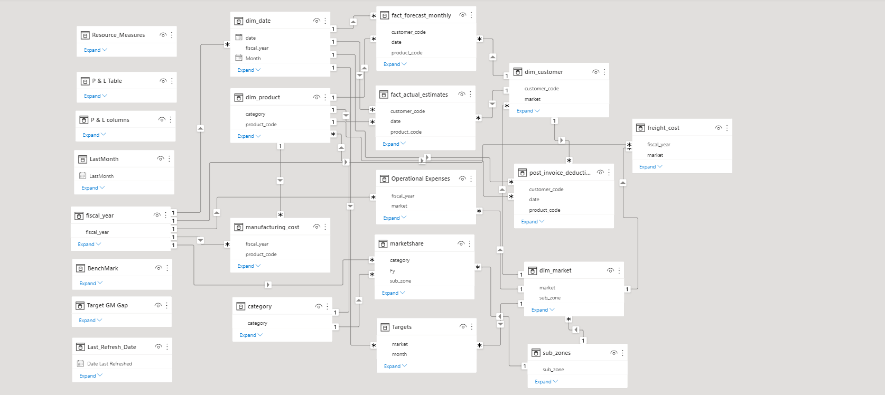
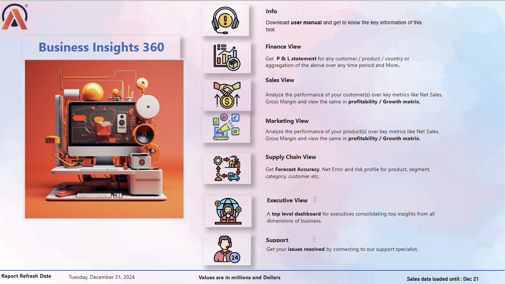
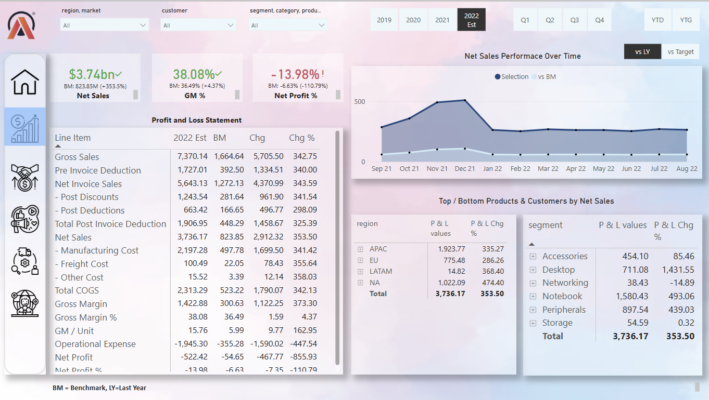
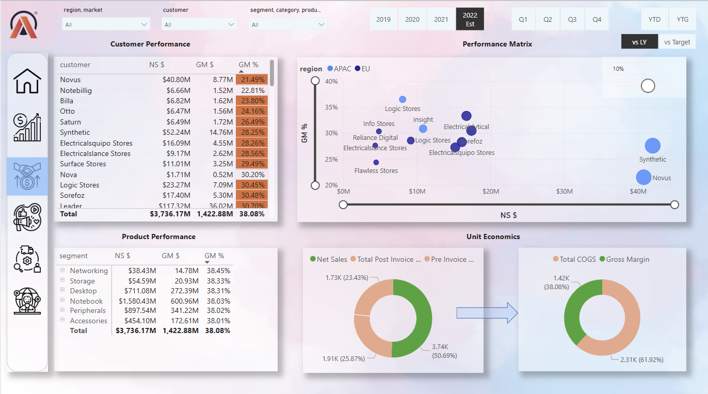
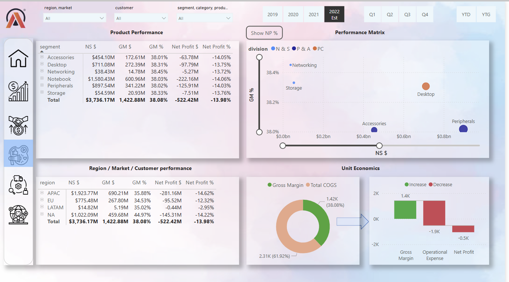
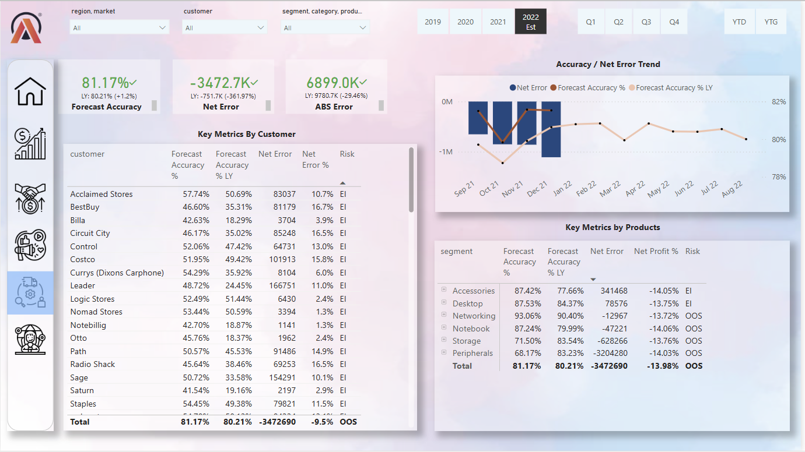
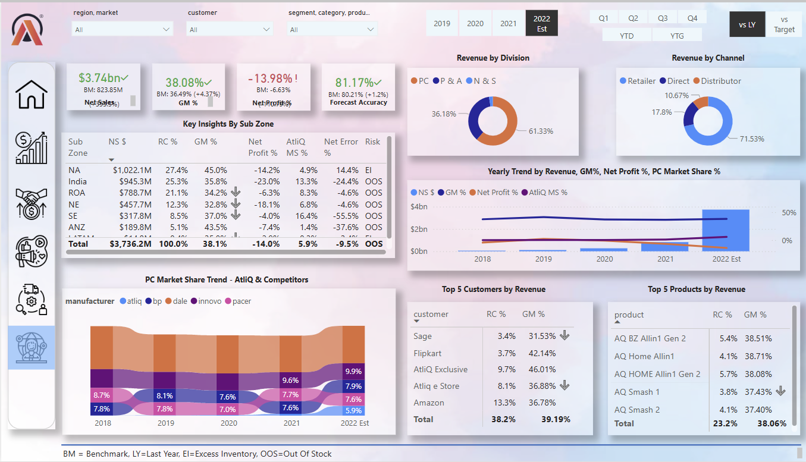

# Business Insights 360 - AtliQ Hardware

## Project Overview
AtliQ Hardware is growing rapidly in recent years, and they have decided to implement data analytics using Power BI in their company for the first time. This initiative aims to surpass their competitors in the market and make data-driven decisions. The project focuses on providing answers to stakeholders across various aspects like finance, sales, marketing, and supply chain.

I worked on this project by following the [Codebasics Power BI Course](https://codebasics.io/bootcamps/dashboard/data-analytics-bootcamp-with-practical-job-assistance). The course gave me the technical foundation to implement this project.

**Live Report Link:** [Business Insights 360 - AtliQ Hardware](https://www.novypro.com/create_project/business-insight-360-atliq-hardware)

## Tech Stacks
- **SQL**
- **Power BI Desktop**
- **Excel**
- **DAX Language**
- **DAX Studio** (for optimizing the report)
- **Power BI Services**

## Power BI Techniques Learned
- Questions to ask before starting the project
- Creating calculated columns
- Creating measures using DAX language
- Data modeling
- Using Bookmarks to switch between visuals
- Page navigation with buttons
- Using the `DIVIDE` function to prevent zero division errors
- Creating date tables using M language
- Dynamic titles based on applied filters
- Using KPI indicators
- Conditional formatting (values, icons, background color)
- Data validation techniques
- Power BI services (publishing reports, setting up auto-refresh, Power BI App creation)
- Collaboration, workspace, and access permissions in Power BI services

## Business-Related Terms
- Gross Price
- Pre-Invoice Deductions
- Post-Invoice Deductions
- Net Invoice Sale
- Gross Margin
- Net Sales
- Net Profit
- COGS (Cost of Goods Sold)
- YTD (Year to Date)
- YTG (Year to Go)
- Direct Sales, Retailers, Distributors, and Consumers

## Company Background
AtliQ Hardware has expanded rapidly, with a global presence. They sell computer products and accessories through three main channels:
- **Retailers**
- **Direct Sales**
- **Distributors**

Recently, AtliQ Hardware faced unexpected losses after opening a store in the USA. This prompted the company to establish a data analytics team for better decision-making and to improve their market position.

## Key Questions Before Starting the Project
- What is the objective of building this Power BI dashboard?
- How will success be measured?
- What is the project deadline?
- Are stakeholders expecting a preview before the actual release?
- What are stakeholders' hopes and fears for the project?
- Who will be using the dashboard and for what purposes?
- What resources and data are needed?
- Are there any design or visual expectations from stakeholders?

## Dataset Understanding

### Dimension Tables:
- **dim_customer**: Contains 75 distinct customers, 27 markets (e.g., USA, India), and 2 types of platforms (Brick & Mortar, E-Commerce).
- **dim_market**: Contains data for 27 distinct markets with regions (APAC, EU, LATAM, etc.).
- **dim_product**: Contains various product categories (e.g., PC, Notebook, Accessories) and variants.

### Fact Tables:
- **fact_forecast_monthly**: Contains forecast data for customer needs.
- **fact_sales_monthly**: Contains sales data (sold quantity) for analysis.
- **freight_cost**: Details of travel costs for each market.
- **gross_price**: Product prices by product code.
- **manufacturing_cost**: Manufacturing costs by product code and year.
- **pre_invoice_deductions**: Deductions for each customer.
- **post_invoice_deductions**: Further post-invoice deductions.

### Data Importing
The data is stored in a MySQL database, and the datasets were imported into Power BI using the provided credentials.

## Data Model
- Data modeling is the backbone of the report.
- Here is the data model used for this project:

- Followed **Snowflake Schema** modeling.
- Ensured best practices for data modeling to enhance performance and clarity.

## Dashboard Designing

### Visual Views:
- **Home View**: Overview with navigation to different sections.  

- **Finance View**: Insights into financial data.  

- **Sales View**: Sales performance analysis.  

- **Marketing View**: Marketing-related insights.  

- **Supply Chain View**: Visualizes supply chain data.  

- **Executive View**: High-level overview for executives.  

**Full Report**: [Business Insights 360 - AtliQ Hardware](https://www.novypro.com/create_project/business-insight-360-atliq-hardware)

## Project Outcome
The report provides stakeholders with the ability to make informed decisions based on data-driven insights. It helps answer critical business questions and enables continuous improvement by identifying areas for optimization and growth.
